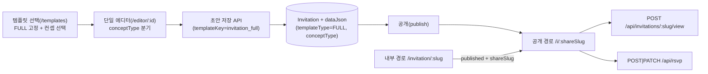

# 정리된 초대장 시스템 구조 (FULL 단일 엔진)

본 문서는 기존 FULL/BASIC/SIMPLE 및 Message/Branded 분산 구조를 정리하고, `FULL + conceptType` 구조로 통합한 기준입니다.

---

## 단일 흐름 다이어그램

핵심:
- `templateType`: **`FULL` 단일**
- `conceptType`: **`WEDDING` / `FUNERAL` / `GENERAL`**
- 공통 기능(hero/gallery/map/schedule/rsvp/accounts/share/music)은 동일 엔진에서 사용

---

## 기능 동작 상태

| 기능 | 상태 | 비고 |
|------|------|------|
| FULL 단일 엔진 | 수정됨 | `invitation_full` 중심, legacy key는 alias로 흡수 |
| 컨셉 선택 | 수정됨 | `/templates`에서 결혼식/부고장/일반 행사 선택 후 에디터 진입 |
| 단일 렌더러 | 수정됨 | `FullInvitationRenderer`에서 `conceptType` 분기 |
| 단일 에디터 진입 | 수정됨 | `/editor/:id` 단일 경로, `concept` 쿼리/저장 데이터로 분기 |
| 공개 URL | 정상 | `/i/{shareSlug}` 유지 |
| 내부 URL | 정상 | `/invitation/{slug}` 유지(공개본은 `/i`로 리다이렉트) |
| RSVP API 단일화 | 정상 | `/api/rsvp` 기반, localStorage RSVP 제거 유지 |
| 조회수 트래킹 | 정상 | `/i`에서 `trackInvitationView(invitation.slug)` |

---

## 제거/정리된 구조

- 템플릿 선택 UX에서 **BASIC/SIMPLE 제거** (FULL 엔진 단일 노출)
- 템플릿 선택 UX에서 **Message/Branded 제거**
- 레지스트리 기준 **message 계열 정적 엔트리 제거** (운영 경로에서 비사용)

---

## 컨셉별 확장 필드 기준

- `WEDDING`: `groom` / `bride` / `parents(텍스트)`
- `FUNERAL`: `deceased` / `funeralHall` / `schedule`
- `GENERAL`: 공통 필드 중심

저장 시에는 `dataJson` 내 `templateType: 'FULL'`, `conceptType`를 포함하고, 렌더 단계에서 분기합니다.

---

## 변경 지점

| 목적 | 파일 |
|------|------|
| FULL 렌더 분기 | `frontend/src/templates/full/FullInvitationRenderer.tsx` |
| 템플릿 레지스트리 단일화 | `frontend/src/templates/registry.ts` |
| 컨셉 선택 UI | `frontend/app/templates/page.tsx` |
| 단일 에디터 + 컨셉 분기 | `frontend/app/editor/[slug]/page.tsx` |
| FULL/컨셉 스키마 | `frontend/src/invitation/schemas.ts` |
| 웨딩 데이터 FULL 확장 | `frontend/src/templates/weddingClassic/data.ts` |
